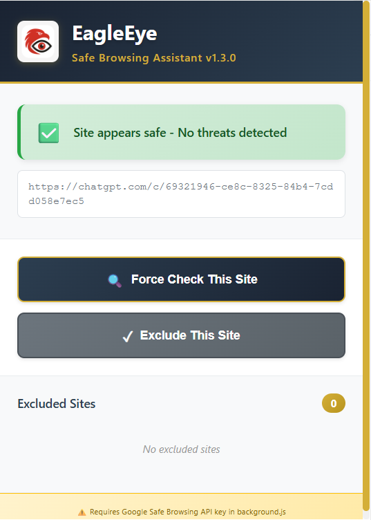
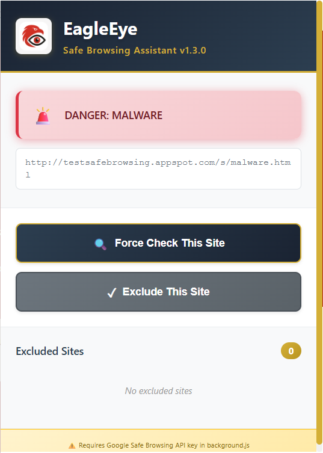
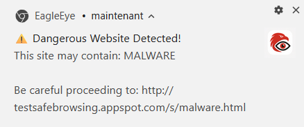

# 🦅 EagleEye - Safe Browsing Extension

A Manifest V3 Chrome extension that protects users from phishing and unsafe websites in real-time using Google Safe Browsing API.

## Screenshots

### Safe Site Detection


### Malicious Site Blocked


### Threat Notification


## Features

- 🛡️ **Real-time Protection** - Automatically checks URLs as you browse
- ⚠️ **Threat Notifications** - Alerts you when dangerous sites are detected
- ✅ **Manual Checking** - Force check any site with one click
- 📋 **Exclusion List** - Whitelist trusted sites to skip checks
- 🎨 **Modern UI** - Clean interface with navy blue and gold color scheme

## Setup Instructions

### 1. Get a Google Safe Browsing API Key

1. Go to [Google Cloud Console](https://console.cloud.google.com/)
2. Create a new project (or select existing one)
3. Enable the **Safe Browsing API**:
   - In the search bar, search for "Safe Browsing API"
   - Click on it and select **Enable**
4. Go to **APIs & Services** → **Credentials** (from the left sidebar)
5. Click **+ Create Credentials** → **API Key**
6. A new API key will be generated and displayed in a popup
7. Copy this API key (it looks like: `AIzaSy...`)
8. ⚠️ Keep this key safe - don't share it publicly!

### 2. Configure the Extension with Your API Key

1. In this repository, navigate to the `src` folder
2. You'll see `config.template.js` - this is the template file
3. Create a new file called `config.js` in the same `src` folder (copy from the template):
   ```bash
   cp src/config.template.js src/config.js
   ```
4. Open `src/config.js` in your text editor
5. Replace `YOUR_API_KEY_HERE` with the API key you copied:
   ```javascript
   const CONFIG = {
     SAFE_BROWSING_API_KEY: 'AIzaSyXxXxXxXxXxXxXxXxXxXxXxXxXxXxX'  // ← Paste your actual key here
   };
   ```
6. Save the file
7. ⚠️ **Important**: Never commit this file to GitHub - it's automatically ignored by `.gitignore`

### 3. Load the Extension into Chrome

1. Open Google Chrome
2. Go to `chrome://extensions/` in the address bar
3. In the top-right corner, toggle **Developer mode** ON (you'll see it switch to blue)
4. Click the **Load unpacked** button that appears
5. Navigate to and select the `EagleEye` folder (the root folder of this project)
6. The extension will load and appear in your extensions list
7. Click the EagleEye icon in your Chrome toolbar to open the popup
8. The extension is now active and will start checking URLs as you browse!

### 4. Verify Everything Works

1. Click the EagleEye extension icon in Chrome
2. You should see a status message like "Site appears safe" or similar
3. Visit a test page to verify it's checking (you can use the [Google Safe Browsing test page](https://testsafebrowsing.appspot.com/))
4. The extension should detect threats and block them

## Usage

- **Automatic Protection**: The extension automatically checks every page you visit
- **Manual Check**: Click the extension icon and use "Force Check This Site"
- **Exclude Sites**: Add trusted domains to the exclusion list
- **Blocked Pages**: If a malicious site is detected, you'll see a warning overlay with options to go back or leave

## Privacy & Data Protection

🔒 **EagleEye does NOT collect or track any user data.** Here's what you need to know:

### What EagleEye Does NOT Do:
- ❌ **No data collection** - We don't collect any information about your browsing habits
- ❌ **No tracking** - We don't track where you go or what you do online
- ❌ **No analytics** - We don't use analytics tools to monitor user behavior
- ❌ **No logging** - We don't log your browsing history or visited URLs
- ❌ **No user profiling** - We don't create profiles or sell your data to anyone
- ❌ **No third-party sharing** - We don't share any information with advertisers or third parties

### What EagleEye DOES Do:
- ✅ **Local processing** - URL checks happen locally on your computer
- ✅ **API only** - Only URLs are sent to Google Safe Browsing API to check for threats
- ✅ **No storage** - Threat check results are cached locally for 5 minutes then deleted
- ✅ **Open source** - You can review the code to verify what we claim
- ✅ **Your privacy** - Your browsing is completely private to you

### How Data is Handled:
- The extension only sends URLs to Google's Safe Browsing API when checking for threats
- Google's privacy policy applies to their API: [Google Privacy Policy](https://policies.google.com/privacy)
- Results are cached locally on your machine for performance
- Excluded domains are stored locally in your browser's storage
- No data is ever sent to EagleEye servers (there aren't any!)

## Security Note

⚠️ **Never commit your `src/config.js` file to Git!** This file contains your API key and is automatically ignored by `.gitignore`. Keep your API key private!

## API Quota

The Safe Browsing API offers 10,000 requests per day for free, which is sufficient for personal use.

## Version History

- **v1.4.0** - Added page blocking overlay for malicious sites
- **v1.3.0** - Added exclusion list management
- **v1.2.0** - Added popup UI with status display
- **v1.1.0** - Initial Safe Browsing API integration
- **v1.0.0** - Basic extension structure

## License

See LICENSE file for details.

## Support

For issues or questions, please open an issue.
